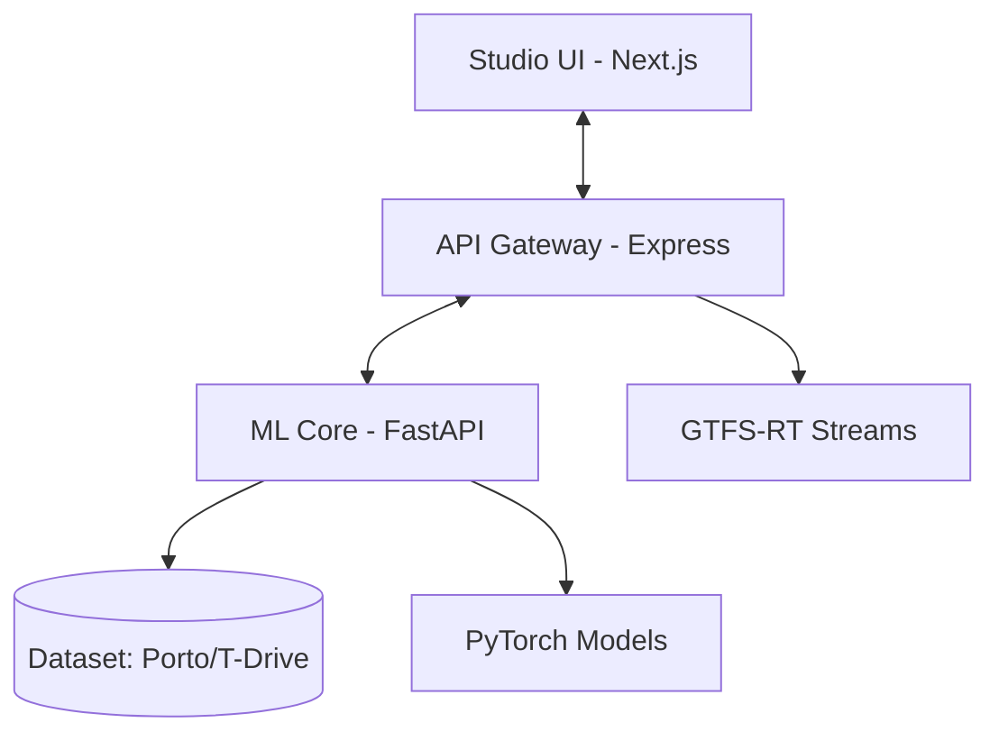

# CAD-Mob: AI Mobility Intelligence


**CAD-Mob** is a high-performance, production-ready mobility intelligence platform. It transforms raw urban data into actionable insights through a multi-service architecture that bridges generative diffusion models, causal reasoning, and real-time telemetry.

---

## 🏗️ System Architecture

CAD-Mob operates as a distributed system of three primary services, orchestrated via Docker.



| Tier | Component | Technology | Role |
| :--- | :--- | :--- | :--- |
| **Frontend** | Studio UI | Next.js 16 (Turbopack) | 3D Visualization, Interventional Control |
| **Gateway** | API Bridge | Express.js | GTFS-RT Ingestion, Auth, API Proxy |
| **Pillars** | Intel Core | Python (FastAPI) | ProDiff (Gen), AgentMove (Reason), Causal SCM |
| **Sandbox** | Model Training | PyTorch / CUDA | GPU-accelerated refinement |

---

## 🚀 Key Pillars of Intelligence

### 1. ProDiff Predictor (Generative Mobility)
Utilizes iterative denoising logic (Reverse Diffusion) implemented in NumPy and PyTorch to synthesize highly realistic mobility trajectories based on probabilistic urban constraints.

### 2. Causal SCM Head (Urban Interventions)
Implements Structural Causal Models (SCM) using `dowhy` to estimate the absolute effect of urban interventions (e.g., "What happens if we close this road?") rather than just predicting correlations.

### 3. AgentMove Reasoning
A cognitive head that models user behavioral history and routine patterns to reason about semantic transitions within the mobility web.

### 4. Real-Time Ingestion (GTFS-RT)
Native support for high-temporal resolution transit telemetry, streaming live vehicle positions and service alerts into the latent representation.

---

## 📂 Project Structure

```text
CAD-mob/
├── api/                # Python ML Core (FastAPI)
│   ├── main.py         # Entry point for ML services
│   └── models/         # Model architectures (ProDiff, SCM)
├── server/             # Express.js Gateway (TypeScript)
│   ├── src/            # GTFS parsers and API Proxy logic
│   └── package.json    # Backend scripts
├── src/                # Frontend (Next.js 16)
│   ├── app/            # Pages: Dashboard, 3D Map, City Analytics
│   ├── components/     # UI: 3D Renderers, Layouts, shadcn/ui
│   ├── lib/            # Logic: Causal logic, Diffusion sampling
│   └── styles/         # Modern CSS (Tailwind 4)
├── infra/              # Containerization (Dockerfiles)
├── data/               # Datasets (Porto Taxi, T-Drive TXT)
├── models/             # Binary model weights (.pth)
├── public/             # Static assets
├── docker-compose.yml  # Full-stack orchestration
└── requirements.txt    # ML dependencies (PyTorch, DoWhy)
```

---

## 🛠️ Getting Started

### Prerequisites
- [Docker](https://www.docker.com/) & Docker Compose
- [Node.js](https://nodejs.org/) (for local frontend development)
- [Python 3.10+](https://www.python.org/) (for local ML dev)

### Quick Start (Recommended)
Launch the entire ecosystem with a single command:

```bash
docker-compose up --build
```

### Access Points
- **Studio UI**: `http://localhost:3000`
- **Express Gateway**: `http://localhost:8000`
- **Python ML Core**: `http://localhost:8001`

---

## 🧪 Development & Testing

### Frontend (Next.js)
```bash
npm install
npm run dev
```

### Server (Express)
```bash
cd server
npm install
npm run dev
```

### ML Testing
The project uses **Vitest** for frontend testing and standard mocking for Python core services.
```bash
npm run test        # Run Unit Tests
npm run test:ui     # Open Vitest UI
```

---

## 🔮 Roadmap
- [ ] **Model Weights**: Train ProDiff U-Net on GPUs and swap `models/prodiff_latest.pth`.
- [ ] **Causal Discovery**: Automate DAG generation from Porto data using `causal-learn`.
- [ ] **Kubernetes**: Scale using the `deployment-pro` guidelines in `infra/`.

---

## 📄 License
This project is licensed under the MIT License - see the LICENSE file for details.
